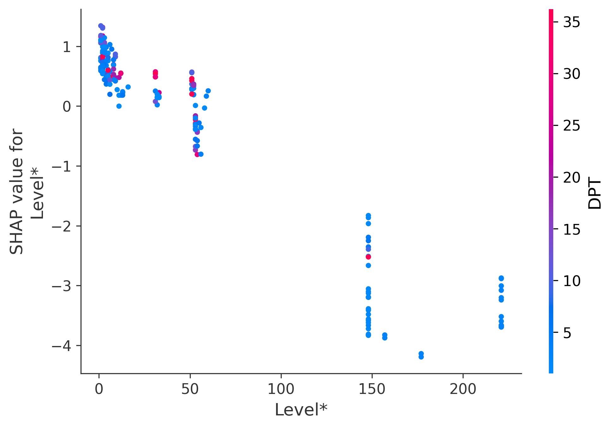

# 详细SHAP分析报告

## 核心发现
- 主导特征 `Level*` 的绝对影响力是第二特征的2.0倍
- 最强特征交互：`Level* × OCavg`（交互强度：0.116）

## 特征详细分析
### Level*

| 分箱区间       |   样本数 |   正例率 |    平均SHAP | 特征   |
|:---------------|---------:|---------:|------------:|:-------|
| (0.999, 3.0]   |       54 | 0.444444 |  0.00540353 | Level* |
| (3.0, 31.0]    |       54 | 0.388889 |  0.00417108 | Level* |
| (31.0, 148.0]  |       75 | 0.333333 | -0.0428832  | Level* |
| (148.0, 221.0] |       24 | 0        | -0.0812024  | Level* |

### OCavg

| 分箱区间     |   样本数 |   正例率 |    平均SHAP | 特征   |
|:-------------|---------:|---------:|------------:|:-------|
| (0.999, 1.6] |      104 | 0.288462 | -0.0274585  | OCavg  |
| (1.6, 2.26]  |       50 | 0.48     |  0.00438549 | OCavg  |
| (2.26, 10.0] |       52 | 0.288462 | -0.0404892  | OCavg  |

### TCOM_RAT

| 分箱区间        |   样本数 |   正例率 |    平均SHAP | 特征     |
|:----------------|---------:|---------:|------------:|:---------|
| (-0.001, 0.046] |      104 | 0.5      |  0.00742857 | TCOM_RAT |
| (0.046, 0.273]  |       52 | 0.211538 | -0.0448987  | TCOM_RAT |
| (0.273, 4.533]  |       51 | 0.137255 | -0.0605081  | TCOM_RAT |

### MPC

| 分箱区间       |   样本数 |   正例率 |   平均SHAP | 特征   |
|:---------------|---------:|---------:|-----------:|:-------|
| (-0.001, 4.0]  |       56 | 0.357143 | -0.018419  | MPC    |
| (4.0, 12.0]    |       44 | 0.318182 | -0.0236924 | MPC    |
| (12.0, 52.25]  |       44 | 0.386364 | -0.0214562 | MPC    |
| (52.25, 905.0] |       48 | 0.333333 | -0.029381  | MPC    |

### DPT

| 分箱区间      |   样本数 |   正例率 |    平均SHAP | 特征   |
|:--------------|---------:|---------:|------------:|:-------|
| (-0.001, 2.0] |       63 | 0.444444 | -0.0275281  | DPT    |
| (2.0, 3.0]    |       43 | 0.186047 | -0.0427638  | DPT    |
| (3.0, 9.5]    |       49 | 0.244898 | -0.0290792  | DPT    |
| (9.5, 166.0]  |       52 | 0.423077 |  0.00672928 | DPT    |

### D

| 分箱区间            |   样本数 |   正例率 |    平均SHAP | 特征   |
|:--------------------|---------:|---------:|------------:|:-------|
| (-0.001, 9.0]       |       53 | 0.264151 | -0.0402598  | D      |
| (9.0, 34.1]         |       51 | 0.529412 |  0.00280024 | D      |
| (34.1, 103.496]     |       51 | 0.254902 | -0.0195202  | D      |
| (103.496, 1315.568] |       52 | 0.307692 | -0.0319534  | D      |

### LOC

| 分箱区间        |   样本数 |   正例率 |   平均SHAP | 特征   |
|:----------------|---------:|---------:|-----------:|:-------|
| (3.999, 22.0]   |       53 | 0.301887 | -0.0211482 | LOC    |
| (22.0, 60.0]    |       52 | 0.442308 | -0.0150091 | LOC    |
| (60.0, 184.5]   |       50 | 0.34     | -0.0248148 | LOC    |
| (184.5, 2415.0] |       52 | 0.269231 | -0.0289617 | LOC    |

### Dcy*

| 分箱区间       |   样本数 |   正例率 |    平均SHAP | 特征   |
|:---------------|---------:|---------:|------------:|:-------|
| (-0.001, 4.0]  |       54 | 0.444444 |  0.00490931 | Dcy*   |
| (4.0, 41.0]    |       54 | 0.351852 |  0.00164825 | Dcy*   |
| (41.0, 217.0]  |       49 | 0.326531 | -0.0523833  | Dcy*   |
| (217.0, 367.0] |       50 | 0.22     | -0.0487079  | Dcy*   |

### OSavg

| 分箱区间      |   样本数 |   正例率 |     平均SHAP | 特征   |
|:--------------|---------:|---------:|-------------:|:-------|
| (-0.001, 1.0] |       55 | 0.218182 | -0.0478459   | OSavg  |
| (1.0, 3.31]   |       48 | 0.416667 | -0.000979216 | OSavg  |
| (3.31, 5.415] |       51 | 0.411765 | -0.000641475 | OSavg  |
| (5.415, 30.0] |       52 | 0.307692 | -0.0390501   | OSavg  |

### OSmax

| 分箱区间      |   样本数 |   正例率 |    平均SHAP | 特征   |
|:--------------|---------:|---------:|------------:|:-------|
| (-0.001, 1.0] |       59 | 0.220339 | -0.04637    | OSmax  |
| (1.0, 8.0]    |       46 | 0.391304 | -0.00290565 | OSmax  |
| (8.0, 22.0]   |       51 | 0.470588 | -0.00358919 | OSmax  |
| (22.0, 143.0] |       50 | 0.28     | -0.0337862  | OSmax  |

### DPT*

| 分箱区间       |   样本数 |   正例率 |    平均SHAP | 特征   |
|:---------------|---------:|---------:|------------:|:-------|
| (-0.001, 16.0] |       52 | 0.403846 | -0.00885065 | DPT*   |
| (16.0, 77.0]   |       53 | 0.45283  | -0.0125825  | DPT*   |
| (77.0, 355.0]  |       50 | 0.3      | -0.0277469  | DPT*   |
| (355.0, 939.0] |       52 | 0.192308 | -0.0410311  | DPT*   |

### CONS

| 分箱区间      |   样本数 |   正例率 |   平均SHAP | 特征   |
|:--------------|---------:|---------:|-----------:|:-------|
| (-0.001, 1.0] |      151 | 0.317881 | -0.0250937 | CONS   |
| (1.0, 2.0]    |       27 | 0.444444 | -0.0121035 | CONS   |
| (2.0, 13.0]   |       29 | 0.344828 | -0.0183493 | CONS   |

### Query

| 分箱区间      |   样本数 |   正例率 |    平均SHAP | 特征   |
|:--------------|---------:|---------:|------------:|:-------|
| (-0.001, 2.5] |       52 | 0.5      | -0.00127457 | Query  |
| (2.5, 4.0]    |       54 | 0.240741 | -0.0292191  | Query  |
| (4.0, 9.0]    |       51 | 0.372549 | -0.0268594  | Query  |
| (9.0, 138.0]  |       50 | 0.24     | -0.0326826  | Query  |

### Level

| 分箱区间     |   样本数 |   正例率 |    平均SHAP | 特征   |
|:-------------|---------:|---------:|------------:|:-------|
| (0.999, 2.0] |      112 | 0.232143 | -0.0428159  | Level  |
| (2.0, 6.0]   |       47 | 0.468085 |  0.0107506  | Level  |
| (6.0, 15.0]  |       48 | 0.458333 | -0.00745762 | Level  |

### STAT

| 分箱区间       |   样本数 |   正例率 |    平均SHAP | 特征   |
|:---------------|---------:|---------:|------------:|:-------|
| (-0.001, 6.0]  |       60 | 0.3      | -0.032249   | STAT   |
| (6.0, 22.0]    |       46 | 0.456522 | -0.00345132 | STAT   |
| (22.0, 84.0]   |       49 | 0.306122 | -0.0207202  | STAT   |
| (84.0, 1333.0] |       52 | 0.307692 | -0.0295977  | STAT   |

### NAAC

| 分箱区间      |   样本数 |   正例率 |   平均SHAP | 特征   |
|:--------------|---------:|---------:|-----------:|:-------|
| (-0.001, 2.0] |      124 | 0.354839 | -0.0240866 | NAAC   |
| (2.0, 4.0]    |       36 | 0.416667 | -0.0153106 | NAAC   |
| (4.0, 60.0]   |       47 | 0.234043 | -0.0236203 | NAAC   |

### Cyclic

| 分箱区间       |   样本数 |   正例率 |   平均SHAP | 特征   |
|:---------------|---------:|---------:|-----------:|:-------|
| (-0.001, 46.0] |      155 | 0.412903 | -0.0052002 | Cyclic |
| (46.0, 147.0]  |       52 | 0.115385 | -0.0738854 | Cyclic |

### COM_RAT

| 分箱区间          |   样本数 |   正例率 |   平均SHAP | 特征    |
|:------------------|---------:|---------:|-----------:|:--------|
| (-0.001, 0.00592] |       52 | 0.538462 |  0.0249434 | COM_RAT |
| (0.00592, 0.0482] |       52 | 0.423077 | -0.0129506 | COM_RAT |
| (0.0482, 0.214]   |       52 | 0.25     | -0.0420342 | COM_RAT |
| (0.214, 0.819]    |       51 | 0.137255 | -0.0605081 | COM_RAT |

### RFC

| 分箱区间      |   样本数 |   正例率 |    平均SHAP | 特征   |
|:--------------|---------:|---------:|------------:|:-------|
| (-0.001, 7.0] |       60 | 0.316667 | -0.0208645  | RFC    |
| (7.0, 16.0]   |       48 | 0.458333 | -0.00795732 | RFC    |
| (16.0, 45.5]  |       47 | 0.297872 | -0.0343402  | RFC    |
| (45.5, 449.0] |       52 | 0.288462 | -0.026928   | RFC    |

### OPavg

| 分箱区间      |   样本数 |   正例率 |    平均SHAP | 特征   |
|:--------------|---------:|---------:|------------:|:-------|
| (-0.001, 0.5] |       65 | 0.230769 | -0.0469056  | OPavg  |
| (0.5, 0.958]  |       39 | 0.435897 |  0.00163995 | OPavg  |
| (0.958, 1.5]  |       52 | 0.403846 |  0.00102668 | OPavg  |
| (1.5, 5.648]  |       51 | 0.333333 | -0.0336579  | OPavg  |

## 关键交互效应
### Level* × OCavg

- 平均效应：-0.077
- 绝对强度：0.116

### Level* × DPT

- 平均效应：0.010
- 绝对强度：0.055

### TCOM_RAT × MPC

- 平均效应：0.021
- 绝对强度：0.051

### Level* × MPC

- 平均效应：-0.014
- 绝对强度：0.037

### Level* × TCOM_RAT

- 平均效应：-0.004
- 绝对强度：0.037

### OCavg × TCOM_RAT

- 平均效应：0.003
- 绝对强度：0.035

### MPC × DPT

- 平均效应：-0.005
- 绝对强度：0.033

### OCavg × MPC

- 平均效应：0.006
- 绝对强度：0.032

### OCavg × DPT

- 平均效应：0.002
- 绝对强度：0.030

### TCOM_RAT × DPT

- 平均效应：0.003
- 绝对强度：0.022

